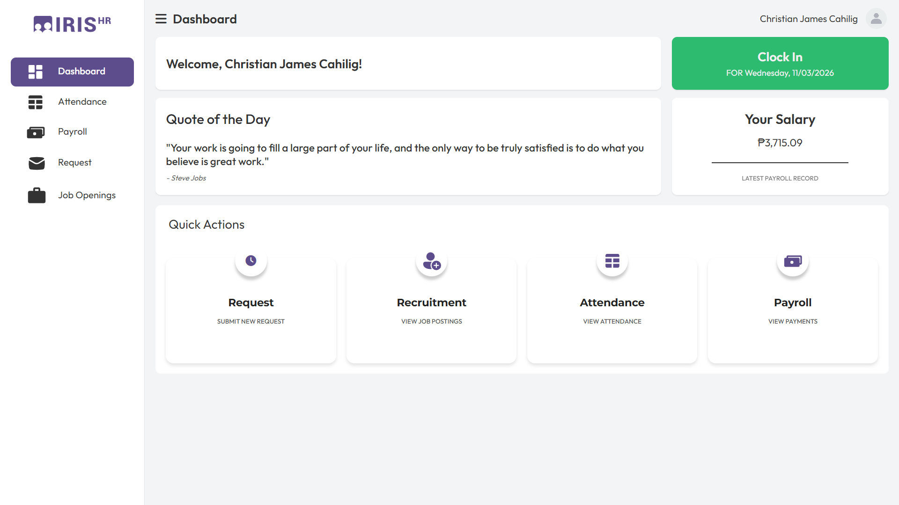
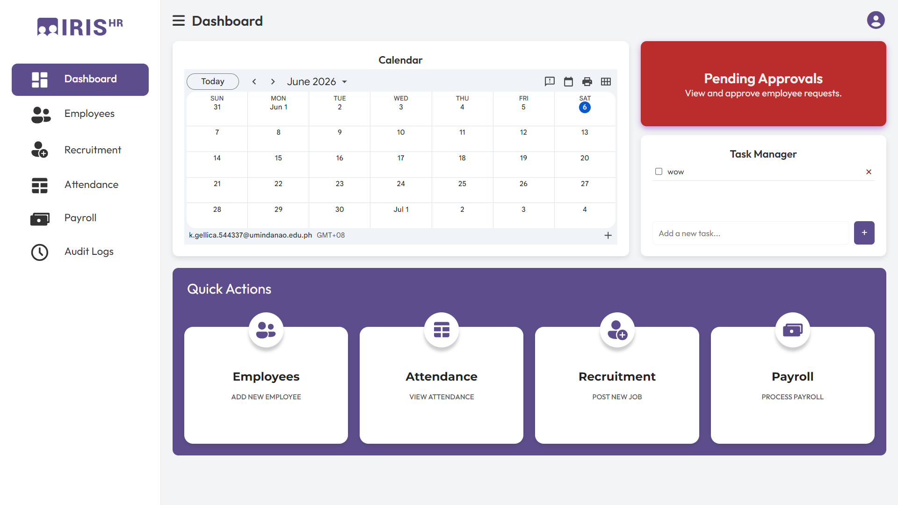
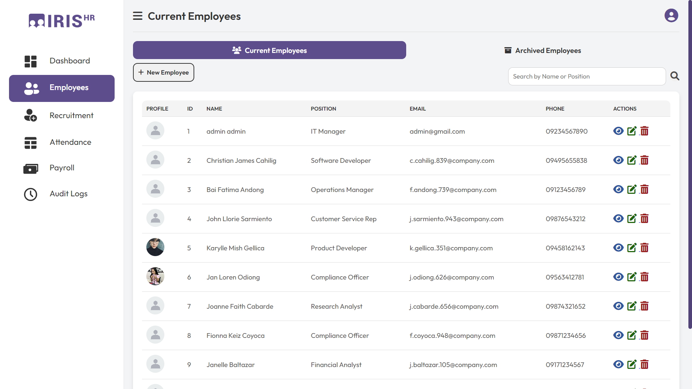
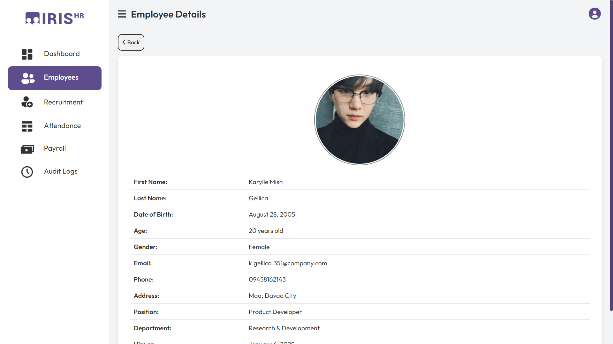
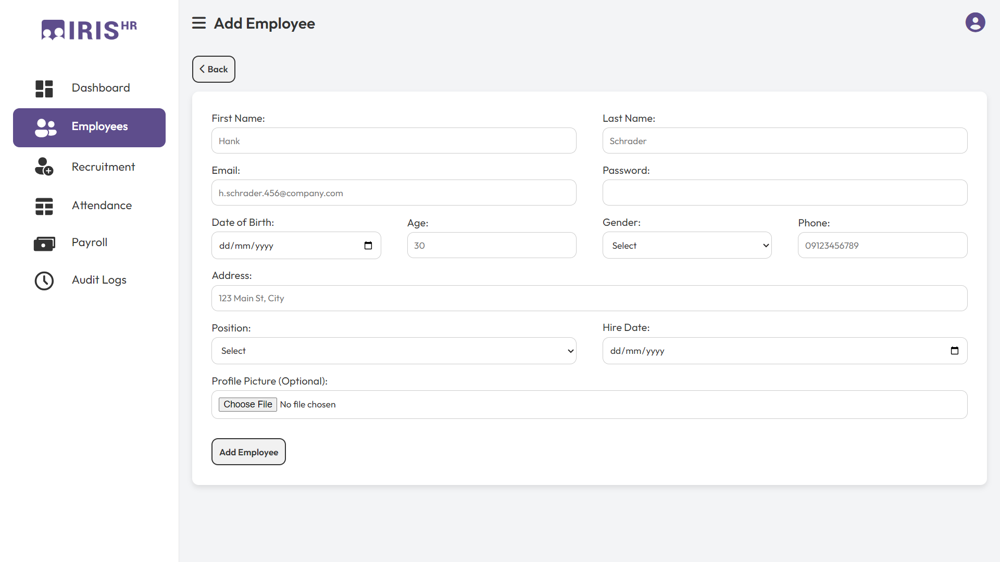
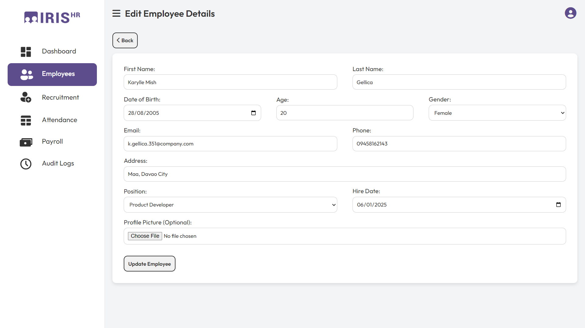
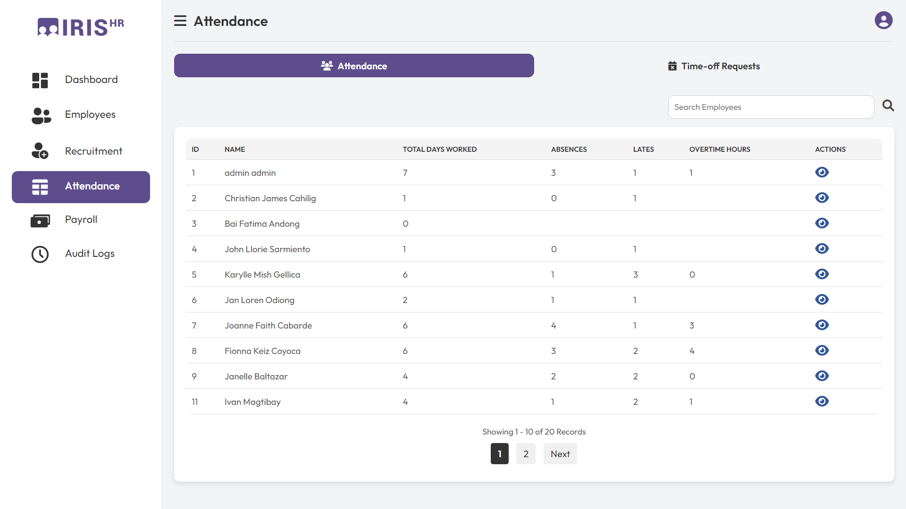
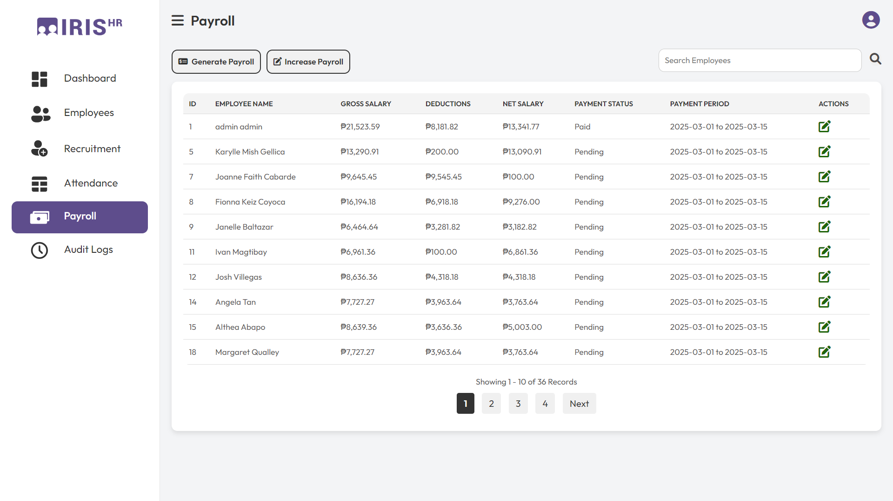

# IrisHR

### Secure Human Resource Management System

IrisHR is a web-based Human Resource Management System designed to centralize employee management, attendance monitoring, payroll processing, recruitment, and administrative operations. This project focused on improving organizational efficiency while incorporating cybersecurity enhancements to protect sensitive employee information.


## Overview

Human Resource systems handle confidential employee records and organizational data, making security a critical requirement. This project involved evaluating an existing HR management platform and implementing security improvements to address common web application vulnerabilities while maintaining usability and functionality.


## Key Features

### Human Resource Management

- Employee record management
- Recruitment tracking
- Attendance monitoring
- Payroll processing
- Leave management
- Department management

### Security Enhancements

- Secure authentication mechanisms
- Password hashing
- Role-Based Access Control (RBAC)
- Session management improvements
- Activity and audit logging
- Input validation and sanitization
- Protection against SQL Injection
- Protection against Cross-Site Scripting (XSS)


## Technologies Used

- PHP
- MySQL
- HTML
- CSS
- JavaScript
- XAMPP
- Apache


## Project Motivation

Human Resource systems store highly sensitive information including employee records, payroll information, attendance logs, and administrative data. This project aimed to improve the security posture of an HR management system by identifying vulnerabilities and implementing practical security controls that strengthen data protection and access management.


## Screenshots

### Dashboard




### Employee Management






### Attendance Monitoring



### Payroll Management




## Database Setup

1. Install XAMPP.
2. Start Apache and MySQL.
3. Open phpMyAdmin.
4. Create a database for IrisHR.
5. Import:

```text
irishr_db.sql
```

6. Update database credentials if necessary.


## Future Improvements

- Multi-factor authentication
- Password reset security enhancements
- Advanced audit monitoring
- Automated security reporting
- API integration for third-party HR services


## Contributors

This project was developed as part of a two-person project.

### Team Members

- Christian James Cahilig
- Karylle Mish Gellica


## My Contributions

- Conducted security assessment and vulnerability analysis
- Implemented authentication and access control improvements
- Enhanced session management mechanisms
- Applied input validation and sanitization techniques
- Assisted in system testing and documentation
- Participated in security-focused redesign discussions


## Learning Outcomes

This project strengthened my understanding of:

- Secure Software Development
- Web Application Security
- Human Resource Information Systems
- Database Design
- Access Control Models
- Risk Assessment
- Software Testing
